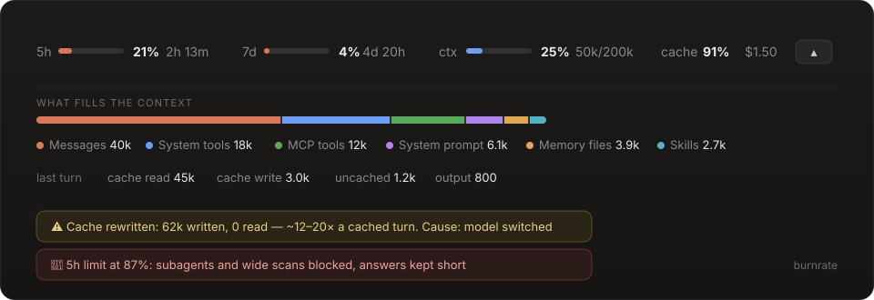

<div align="center">

# burnrate

**See — and slow down — how fast Claude Code burns your Claude.ai limits.**

A [Claude Code mod](https://claude.dev/blog/getting-started-with-claude-code-mods/) for the terminal and the desktop Code tab.

[](LICENSE)
[](https://claude.dev/blog/getting-started-with-claude-code-mods/)
[](https://github.com/Talap-creator/burnrate/releases)



</div>

## Install

```
/plugin marketplace add Talap-creator/burnrate
/plugin install burnrate@burnrate
/reload-plugins
```

Want only one half? Install `limits-band@burnrate` or `limit-guard@burnrate` instead of the full `burnrate`. Don't install the full mod together with a half — they would draw and guard twice.

## What you get

### The band

A strip above the prompt, collapsed to one line:

| | |
|---|---|
| **5h · 7d** | your subscription windows as meters, with time until each resets. Accent below 50%, amber from 50%, red from 80%. |
| **ctx** | how full the context window is, in tokens. |
| **cache** | the session's prompt-cache hit rate — the share of input served from the cache. |
| **$** | what the session has cost so far. |

Press **▾** for the details:

- **What fills the context** — a stacked bar and legend: messages, system tools, MCP tools, system prompt, memory files (CLAUDE.md), skills. The same rows as `/context`, estimated locally, so refreshing them sends no requests.
- **Last turn** — cache read, cache write, uncached input and output. Cache write turns amber when it beats cache read.

### The guard

**Cache watchdog.** A cached token costs about a tenth of a normal one; rewriting the cache costs 1.25–2×. When a turn rewrites the cache instead of reading it, you get a toast with the size of the hit and the likely cause:

- the model was switched,
- the session sat idle past the cache lifetime (5 min or 1 h),
- the system prompt or tools changed — CLAUDE.md, MCP servers, skills, plugins — or `/compact` ran.

**Limit brake.** As the 5-hour window fills up:

| 5h used | what happens |
|---|---|
| threshold − 15 (70% by default) | **soft mode** — every prompt carries a hidden "be concise" note |
| threshold (85% by default), or 7d ≥ 95% | **brake** — subagents and wide scans are refused, every prompt asks for the shortest useful answer, 🛑 in the status line |

Refused while braked: `Agent` / `Task` and swarm dispatch; `Glob **/…` with no path; `Grep` with no path, glob or type; `find .`, `grep -r`, `rg --files`, `ls -R`, `tree`, `du -a`, `Get-ChildItem -Recurse`, `dir /s`. Targeted calls with a real path go through. Claude is told why and to work on specific files instead.

The notes ride as hidden prompt context, not as a system-prompt edit, so switching modes never invalidates the cache.

| command | |
|---|---|
| `/guard` | status, threshold, current usage |
| `/guard off` · `/guard on` | lift or restore the brake for this session |
| `/guard 90` | set the 5h threshold (remembered across sessions) |

## Notes

- Limits appear after the first reply of a session — they arrive with API responses — and only on a Claude.ai subscription. On an API key the band still shows context, cache and cost.
- There is no slot above the transcript, so the band sits right above the prompt. Collapse it with `ctrl+x ctrl+a`.

## Develop

All three plugins are built from one source, [`src/burnrate.tsx`](src/burnrate.tsx), with features toggled per plugin.

```
python scripts/build.py
claude plugin validate plugins/burnrate
claude plugin test plugins/burnrate
```

To hack on it live, point Claude Code at your checkout instead of the marketplace: `claude --plugin-dir plugins/burnrate`, or add the folder to `CLAUDE_CODE_PLUGIN_DIRS` in the `env` block of `~/.claude/settings.json`.

Releases: bump [`VERSION`](VERSION), rebuild, add a [`CHANGELOG`](CHANGELOG.md) entry, push.

## License

[MIT](LICENSE)
